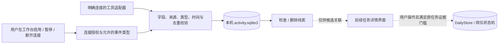

# 本地活动线索收件箱（#23）

本切片提供一个与 `DailyStore`、岗位状态机分开的本机 SQLite 收件箱。它只记录“某个获准工具在某时发生了允许的事件”及可选任务提示，供之后的 #17 集成提出候选关联。**事件不是任务结果**：结束一次工具会话不等于完成任务、实际投递、掌握知识或通过考试。



## 数据与授权边界

- 连接由可信的工作台界面调用 `connect(id, source, allowed_types)` 显式建立；适配器只获得 `ingest` 通道。`ActivityInbox` 是本地持久化与字段验证层，不是跨进程身份认证系统。正式接入时，主程序仍须隔离连接控制方法并核对真实工具提供的事件 API 与权限。这里没有 Codex 桌面事件适配器。
- 基础允许类型为 `work_session_started`、`work_session_ended`、`artifact_updated`；Codex Hooks 适配器另外使用 `turn_prompted`、`turn_stop_observed`、`turn_interrupted`、`tool_used`。每个连接还须从中选择子集。来源必须与连接登记的来源完全一致；暂停、断开或未知连接不得写入新事件。
- 一条事件包含 `event_id`、`source`、`kind`、带时区的 `occurred_at`，可选 `task_hint`、哈希后的 `session_ref`／`turn_ref` 和短 `tool_name`。收件箱补充 `connection_id` 与 `observed_at`。`task_hint` 只是线索，不是已验证关联。拒绝任何其他字段，包括正文、文件路径、屏幕内容、按键、凭证和外部“成功”断言。适配器应提供稳定、无个人信息的事件 ID。实际 Codex 接入范围和安装边界见 [codex-hooks-adapter.md](codex-hooks-adapter.md)。
- 数据默认写在传入的私有 workspace 的 `activity.sqlite3`，与 `daily.sqlite3` 分开；文件使用本机用户读写权限。不得把真实事件数据库提交到公开仓库，也不要在日志中打印个人事件。
- 默认保留 30 天，构造时可设 1–365 天。打开收件箱、写入新事件及调用 `prune_expired()` 时清理过期观察记录。过旧或明显未来的事件会被拒绝。暂时不用云同步。
- `pause` 停止新事件但保留旧记录；`disconnect` 撤销该连接的继续接收能力但仍可检查旧记录。`delete_observation` 删除事件内容，并保留 30 天内的事件 ID 哈希以阻止重放；`forget_connection` 删除连接、观察记录与对应去重标记。断开与删除是两个不同操作。

## 适配器契约与虚构演示

先由宿主工作台根据用户操作建立连接：

```python
inbox.connect("demo-connector", "fictional.tool", ["work_session_ended"])
```

获授权的虚构适配器提交最小事件。实际工具适配器须先确认有受支持的事件源，不能通过读取屏幕、键盘或文件正文模拟事件 API。

```python
event = {
    "event_id": "demo-opaque-001",
    "source": "fictional.tool",
    "kind": "work_session_ended",
    "occurred_at": "2026-09-24T09:00:00+08:00",
    "task_hint": "DEMO-TASK-001",
}
observation = inbox.ingest("demo-connector", event)
```

同一连接的同一事件 ID 与内容重复送达时，返回原记录；同 ID 不同内容会报错。`list_connections()`、`get_connection(id)` 与 `list_observations(id)` 供工作台检查。删除一条用 `delete_observation(id, event_id)`；整个连接连同记录全部清除用 `forget_connection(id)`。

运行不触网、不调用任何真实工具的演示：

```bash
python3 -m scripts.demo_activity_inbox
```

演示使用临时目录和虚构 ID，依次显示启用、观察、暂停拒收、删除与断开。未设置任何任务完成状态。

## 交给 #17 的边界

整合层可以读取收件箱并向用户展示“这条活动可能与任务 X 有关”。关联理由、来源和时间应显示在任务详情；用户可以忽略或删除。需要任务完成时，仍走 `DailyStore.command("complete", ...)` 的类型门槛；岗位投递仍需原岗位状态机的人工确认与实际回执。收件箱不会调用这些命令。
