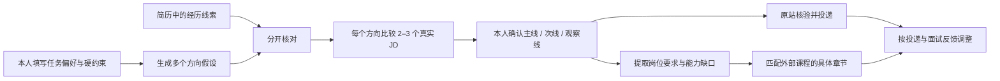

# 方向校准问卷（Issue #1 / #5）

工作台在找岗位之前先保存一份本地问卷。问卷记录求职者愿意长期做的任务、主线/次线/观察线和城市等硬约束，生成可解释的方向假设。它不做性格测评，不从简历自动决定职业，也不输出胜任或录用概率。

## 为什么不能只看简历或只做问卷

- 问卷表达“想做什么”，可能受岗位名称、短期想象和他人建议影响。
- 简历表达“过去做过什么”，其中的数字和职责仍需本人确认，也不能证明以后愿意长期做。
- 真实 JD 表达市场上具体岗位当前写了什么，但不同公司的同名岗位可能差异很大。
- 20–30 分钟的小任务用于观察真实卡点和求助方式，只产生一条新证据，不直接给能力盖章。

因此方向结果保持多个候选。首轮只把排序靠前的方向各取 2–3 个真实 JD，让本人比较日常任务、硬门槛和愿意补的能力，再确认用于找岗的主线、次线和观察线。

## 本地数据与状态

每位用户使用独立的 `private/<user>` workspace。代理录入的方向草案标为“待本人确认”；草案不会成为 agent 的找岗条件。求职者填写全部任务偏好并勾选确认后，页面才把主线、次线和观察线写进找岗任务。方向点数只用于本人内部排序，计算依据在页面直接显示。

简历原文、联系方式、逐字访谈和真实作答不进入公开仓库或 Issue。公开测试只使用虚构用户。岗位候选继续按来源、观察时间和未知项导入；确认方向也不等于候选岗位符合资格或仍在招聘。

## 投递与学习的关系

确认方向后，投递与学习同时开始。工作台从已确认的真实 JD 提取共通要求和方向特有要求，再链接到第三方课程的具体章节；不自建 SQL 等课程正文。打开课程或自报完成只记录进度，不自动证明掌握，也不阻断用户打开原站申请。
