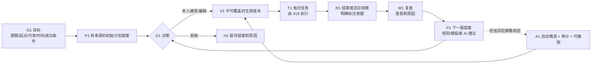
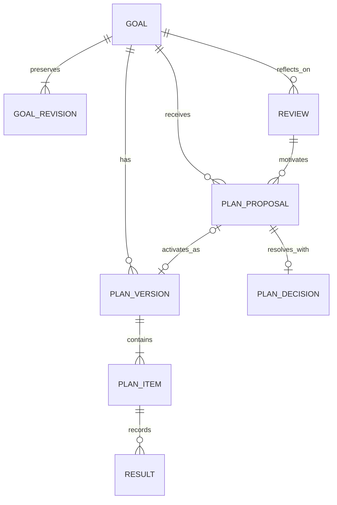

# 通用目标、计划版本与复盘契约（#21 草案）

状态：独立 draft；须与 [#13 的双路径线框](https://github.com/johnnyzhang-eng/career-workbench/issues/13) 对照评审后，才能用于 #17 集成。本文和测试数据全部虚构。`workbench/goals.py` 是本地契约验证器，不生成学习内容、不调用模型、不读取桌面，也不宣称已经完成真人试用。

## 已确认的产品规则

- 首版把秋招和 CET6 做成两条完整路径；其他目标先允许本人手动安排任务。计划从有来源的规则／模板起步，AI 只能提出个性化修改。提案与生效计划严格分开。
- 本人可修改目标和每周可用时间；目标修订不可覆盖，基于旧目标的待决提案失效。目标改动不会暗中改正在执行的任务，需再提出并确认计划版本。
- “实时”按系统时间推进。目标自己的时区决定本地日；不让角色动画改变现实截止。未核实的岗位截止、考试时间或外部事件不显示为精确事实。
- 工作台操作与用户明确连接的工具事件可作为活动线索。工具时长、窗口切换、Codex 任务或代码提交都不能独自证明任务完成、掌握知识、考试通过或投递成功。
- 未完成和低于预期保留实际结果与原因，给出温和且可解释的调整建议；没有罚分或自动断签逻辑。
- 自动权限仅含：**调整未开始的弹性任务在同一个本地日内的时段，或重排这类任务的显示顺序**。每次自动应用都记录提案、策略 ID、前后版本、时间和撤销事件。跨日顺延、周任务量、阶段计划、目标、硬截止、任务删除、完成证据规则均需用户决策。



## 数据与事实边界

| 对象 | 核心字段 | 含义和限制 |
|---|---|---|
| Goal | ID、修订号、标题、领域、IANA 时区、每周分钟、起点文字、本人成功条件、目标时间与可信度 | `target_confidence` 为 `unknown/self_set/estimated/verified`。本人设的目标日不等于官方考试日；`verified` 必须附来源和核验时间。`update_goal` 只接受用户操作，旧修订保留；任意自定义目标不需要岗位 ID。 |
| PlanProposal | ID、Goal ID、基于目标修订和计划版本、复盘 ID、原因、完整任务列表、`method`、来源 | `method=rule_template/ai_suggestion/manual`。初始版本从模板或本人手动任务起步；AI 修改仍是待决策提案，`source_ref` 记录规则模板版本或外部来源。目标更新后旧提案标为 `superseded`。提案本身不会安排每日任务。 |
| PlanVersion | 递增版本、来源提案、决策、决策时间、完整任务列表、撤销目标版本 | 接受、编辑、受策略约束的自动微调、撤销都会生成新版本；旧版和旧结果不覆盖。 |
| Plan item | 稳定 task ID、标题、任务类型、来源种类与 ID、安排时间、预计分钟、完成条件、可否弹性调整、截止时间与可信度 | CET6 练习用 `source_kind=goal`、`source_id=goal ID`、`task_kind=practice`；其他手动目标可以用 `custom`。求职练习仍可关联岗位，但目标契约本身不核验岗位真伪。截止可信度独立于安排时间。 |
| Result | 关联生效版本与 task ID、实际分钟、状态、练习指标、证据位置、备注、依据类型 | `self_report` 可记录完成／部分／未做／受阻；`tool_observation` 只能记录 `observed`，不能直接转成完成。`metric` 是记录的测量值，不等于考试通过。 |
| Review | 目标、当前版本、触发原因、关联结果、发现、外部事件来源 | 支持漏做、低于预期、新外部事件、本人修改目标、周期回顾。外部事件必须有引用位置。算法如何提出建议属于后续适配器；此层保留候选和理由。 |
| PlanDecision | `accept/edit/decline/auto_apply`、发起者、原因、策略 ID | 手动决策要求 `actor=user`；自动决策要求系统策略钩子通过，且 diff 只含允许的弹性时段或顺序。`undo_auto` 产生新的恢复版本，不删除审计记录。 |

计划项 `due_confidence=unknown` 时 `due_at=null`。`verified` 必须有 `due_source_ref` 和 `due_checked_at`。由于普通任务的 `scheduled_at` 是内部计划时间，它不会自动变成外部硬截止。



## 两条七日虚构路径

以下所有岗位、练习分数和时间都是**虚构设计数据**，不是实时招聘或考试信息。#13 负责将同一状态画成角落小窗、今日页、任务详情和复盘页，并由用户逐屏校正。

| 日 | 秋招路径：事实 → 计划反应 | CET6 路径：事实 → 计划反应 |
|---|---|---|
| 1 | 本人建“准备并投递合适岗位”目标；模板提议核验虚构 A 岗、B 岗，B 截止未知；本人接受。 | 本人建“按自设标准练习七天”目标，填起点与每周 420 分钟；模板提出听力、阅读等任务，本人接受。 |
| 2 | A 岗原页面及届别核验有记录；完成核验任务，岗位仍未投。 | 完成虚构听力练习，记录 14/20、错题位置与实际分钟；完成不等于掌握。 |
| 3 | B 岗届别仍不明，保留 `unknown/hold`；没有精确截止倒计时。 | 阅读练习 9/20，低于虚构预期；留下测量结果，复盘提出增加阅读练习的下一版候选。 |
| 4 | A 岗材料准备并由本人确认，旧状态机记录版本；目标计划并不伪造这一事件。 | 本人接受或编辑调整候选；旧计划、9/20 结果仍可查。 |
| 5 | 打开 A 岗原站仅产生观察；真正提交后才由旧状态机保存虚构回执，申请任务才可完成。 | 一次练习漏做并写下原因；任务跨日仍保留原计划与实际，不罚分。系统提出重排；跨日顺延需本人确认。 |
| 6 | 收到虚构面试邀请，作为有来源的外部事件，提出新增准备项；不自动改已确认申请事实。 | 有来源的虚构课程临时活动改变可用时段；提出下一版候选，用户可接受／编辑／拒绝。 |
| 7 | 回顾核验、回执与面试准备结果；新计划仍需用户处理提案。 | 复盘本周实际、低分和漏做原因；小窗与完整工作台读同一生效版本与待决策候选。 |

## 契约与命令样例

下面是 #21 的本地 Python API；使用一次性虚构 workspace。可执行的命令序列见 [`goal_contract_fixture.json`](../templates/goal_contract_fixture.json)，测试会逐条重放它。同一 `event_id` 和相同内容重复提交会幂等；复用 ID 改命令会拒绝。

```python
from workbench.goals import GoalStore

store = GoalStore("private/fictional-demo")
store.command("create_goal", "E-1", {"goal": {"id": "DEMO-CET6", "title": "虚构 CET6 练习", "domain": "learning", "timezone": "Asia/Shanghai", "weekly_minutes": 420, "success_criterion": "记录阶段练习与本人复盘", "baseline": "虚构起点", "target_at": "2026-11-01T20:00:00+08:00", "target_confidence": "self_set", "target_source_ref": None, "target_checked_at": None}})
# propose_plan -> decide_plan(accept/edit/decline) -> record_result -> record_review -> propose_plan
snapshot = store.snapshot("DEMO-CET6")
assert snapshot["goal"]["active_version"] == 0  # 仅创建目标，还没有生效计划
store.close()
```

接受初版后的快照结构（节选）如下；`plans[0].items` 是生效版本，`proposals[0]` 仍保存原候选与决策元数据：

```json
{
  "goal": {"id": "DEMO-CET6", "active_version": 1, "timezone": "Asia/Shanghai"},
  "goal_revisions": [{"revision": 1, "actor": "user", "reason": "创建目标"}],
  "plans": [{"version": 1, "goal_revision": 1, "from_proposal": "P-1", "decision": "accept", "items": [{"task_id": "DEMO-READ-1", "source_kind": "goal", "source_id": "DEMO-CET6", "task_kind": "practice"}]}],
  "proposals": [{"id": "P-1", "method": "rule_template", "source_ref": "fictional-template-v1", "status": "accepted", "version": 1}],
  "results": [], "reviews": []
}
```

快照是**节选**，实际 API 返回上述表格所列的完整字段。角落小窗可只显示今日行动和一个“有待决定的调整”提示；展开应用显示提案差异、理由、来源及接受／编辑／拒绝。自动微调须提供可点开的“调整记录／撤销”入口，不能只悄悄移动任务。

## 与 #18、求职状态机的连接

1. GoalStore 保存目标、版本、结果、复盘和提案；`DailyStore` 保存任务 schedule/start/complete/defer/block/cancel、跨日和提醒。二者使用同一私有 workspace，但本 draft **尚未执行跨库命令**；#17 集成需要设计一致性与失败恢复，再将生效版本中的新增任务安排到 DailyStore。
2. CET6 的计划项在此契约中是 `task_kind=practice`、`source_kind=goal`。#18 当前把 `practice` 限定为岗位任务，不能直接消费这条通用练习；#17 必须扩展 DailyStore 的来源与完成验证适配，支持目标练习的作品／结果引用，同时保留岗位练习的旧 `job_event_seq` 门槛。不得把 CET6 永久伪装成 `custom`。其他通用手动任务可用 `custom`；任务详情通过目标 ID 查回 PlanVersion。GoalStore 的 Result 保存练习指标和复盘解释；工具观察不可补造完成命令。
3. 岗位任务的 DailyStore `source_kind=job`、`source_id=job ID` 不变；GoalStore 的 plan item 通过稳定 task ID 关联它。`apply_job` 仍由原 `career.py` 的批准、材料和 `submitted` 回执事件验证；PlanVersion、打开链接或 GoalStore 的自述都不能代替旧门槛。
4. 自动微调在契约层检查 task ID 集合不变、除安排时间外所有字段不变、顺序只涉及弹性且未开始的任务、移动后仍是同一目标时区的同一天；再由外部策略钩子核验策略 ID。**默认没有自动策略，因此不能自动生效。** #17 必须从 DailyStore 读取真实任务状态，并安全同步时段变化。目标、截止、任务增删和完成规则不在这条自动路径里。
5. 初版模板必须版本化、列明依据；AI 个性化内容带 `method=ai_suggestion` 进入提案区。外部来源仍需人工核验，尤其官方考试日与岗位截止。无来源的通用自定义目标从本人手动任务起步。

### #17 的最小一致性方案

首选把 Goal 与 Daily 事件写入同一个 SQLite 数据库，用**同一连接的事务**提交计划决策和要安排／改期的任务命令；客户端只在提交成功后刷新两种视图。若短期继续双库，计划决策事务应同时写一条 durable outbox（稳定命令 ID、目标版本、task ID、预期动作、状态）；后台适配器以该 ID 幂等写入 DailyStore，成功后将 outbox 标为 `applied`，失败保留并重试。同步完成前快照必须标出 `sync_pending`，不把 GoalStore 中的新时间当作已安排成功。撤销同样走 outbox；它生成补偿命令，不删除已经发生的每日任务事件。两条方案是 #17 的设计建议，本 PR **尚未实现**任一方案。

## 尚待评审的实现风险

- `GoalStore` 与 `DailyStore` 分属两个 SQLite 文件。自动应用与真实任务改期目前没有原子事务；在 #17 集成前不应对外宣称两处已实时同步。
- `auto_policy` 是受信任的宿主钩子。调用方必须核查用户允许的策略版本，且不能把提案自报的“低风险”当证明。撤销一个自动版本会恢复它之前的任务列表；若其后还有自动微调，会一并撤回，UI 须先展示差异；若其后已有本人决策，则需新提案由本人确认。撤销不抹掉已发生的任务和用户结果。
- `record_result` 保存自述与引用位置，不替用户验证源文件内容。考试是否通过、岗位是否提交、技能是否掌握各由相应领域证据流程确认。
