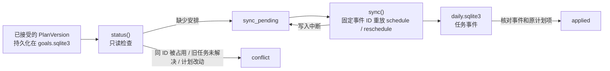

# Goal → Daily 安排桥接（#17 后端草案）

本切片把已生效的 `GoalStore` 计划投影到同一私有 workspace 的 `DailyStore`。它不生成计划、不监听桌面、不打开网站、不提交申请，也没有完成游戏场景或小窗。请用全部虚构数据运行：

```bash
python3 scripts/demo_goal_daily_bridge.py
python3 -m unittest tests.test_goal_daily_bridge -v
```

## 一致性与恢复



`GoalDailyBridge.status(goal_id)` 不写磁盘，返回 `no_plan`、`sync_pending`、`applied` 或 `conflict` 和逐任务原因。`sync(goal_id)` 安排尚未写入的任务，也将已接受的 `auto_apply` / `undo_auto` 和本人确认的同日 `edit` 逐版本重放成 `reschedule` 事件。每项 schedule 和每次调整都有由目标 ID、版本和任务 ID 推导的稳定事件 ID。接受计划先在 `GoalStore` 落盘，因此即使某个每日任务写入后进程退出，重启后再次执行 `sync` 会核对已写入前缀并补齐缺项。桥接时对目标库持有写事务，避免另一个连接同时更换其生效计划；日任务的幂等校验处理重复写入。

这两个库仍不是一个原子事务。客户端在 `sync_pending` 或 `conflict` 时必须显示状态，不把新计划的时间当作已经进入每日清单；重试失败保留 `last_error`。不能只检查任务 ID：桥接会核对安排事件 ID、原计划项、投影内容和目标归属。手工占用同一任务 ID 会报冲突。小窗和完整工作台将来应从同一桥接状态与 `DailyStore` 快照取数，而非各自模拟结果。

## 当前版本策略

首版计划和新版计划中的新增任务可以安排；未变动的旧任务沿用原安排事件和真实 `DailyStore` 状态。已接受的自动微调只会改变同一本地日期内、未开始、明确弹性且没有 `due_at` 的任务时间或显示顺序。`DailyStore` 再次检查当前任务状态、原时间和原顺序；用户在计划接受后开始、延期、阻塞或完成任务，桥接转为 `conflict`，不会覆盖用户动作。撤销自动微调追加恢复事件，初次安排时间与中间版本仍在事件日志中。当前任务投影的 `plan_version` 指向最后一次作用于该任务的计划版本；原 schedule 事件仍保留初次安排版本。

自动微调只允许保留计划项其他内容完全相同；复盘界面上的本人 `edit` 只允许单项未来、未开始、无截止日期的弹性任务在同一个目标本地日期换时段，先显示前后差异，再明确确认。任务内容修改、跨日移动、固定任务、带截止的任务和删除未结束任务依旧显示 `conflict`，等待独立设计，不自行取消或改写。若连续几个版本均有调整，桥接按版本次序补齐审计事件，不直接跳到最终时段。显示顺序按同一目标和本地日期的 `display_order` 排列；其他任务仍按安排时间排列。`reschedule` 不修改完成依据或任务状态，也不能把练习标成掌握、把打开岗位页标成投递。

旧版安排事件中没有 `flexible` / `display_order` 的行仍按原计划项、事件 ID 和目标归属核对，不改写旧事件；未变动时可以继续显示为已同步。由于旧行缺少安全改期所需的前置元数据，复盘编辑入口排除这类任务，并给出明确提示。跨日重排还需设计新的 DailyStore 过渡事件、截止及时间冲突检查和完整计划差异审阅。

安排时间来自计划项；外部截止仅在 `due_confidence=verified` 且有来源和核验时间时标为已核实。每项 `reason` 投影为每日任务的原因，`source_ref` 留在不可覆盖的计划版本中，并随桥接状态返回，供界面打开来源。完成规则的详细说明仍由 `GoalStore` 的计划项持有；实际打勾时 `DailyStore` 的类型证据门槛具有约束力。目标来源 CET6 练习可无岗位 ID，但完成需材料、首次作答和复盘引用。岗位 `apply_job` 仍要求旧求职状态机里的 `submitted` 事件及回执；单纯打开网页、计划生效或打勾都不构成投递。

## 待 #17 完整纵向切片解决

- 完整场景与桌面小窗还未接这层，也未做双窗口、睡眠跨日和真实用户操作验收；不能据后端测试宣称产品可玩或实时同源。
- 跨日顺延、实质计划内容改动与任务删除仍需明确的人为决策和独立补偿设计。
- 将任务完成或延期与 GoalStore 的结果、复盘关联起来，保留自述与工具观察的区别；当前桥接只安排任务。
