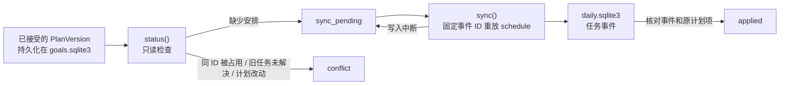

# Goal → Daily 安排桥接（#17 后端草案）

本切片把已生效的 `GoalStore` 计划投影到同一私有 workspace 的 `DailyStore`。它不生成计划、不监听桌面、不打开网站、不提交申请，也没有完成游戏场景或小窗。请用全部虚构数据运行：

```bash
python3 scripts/demo_goal_daily_bridge.py
python3 -m unittest tests.test_goal_daily_bridge -v
```

## 一致性与恢复



`GoalDailyBridge.status(goal_id)` 不写磁盘，返回 `no_plan`、`sync_pending`、`applied` 或 `conflict` 和逐任务原因。`sync(goal_id)` 仅安排当前生效版本中尚未安排的任务；每项使用由目标 ID、版本和任务 ID 推导的稳定事件 ID。接受计划先在 `GoalStore` 落盘，因此即使某个每日任务写入后进程退出，重启后再次执行 `sync` 会跳过已核对的任务并补齐缺项。桥接时对目标库持有写事务，避免另一个连接同时更换其生效计划；日任务的幂等校验处理重复写入。

这两个库仍不是一个原子事务。客户端在 `sync_pending` 或 `conflict` 时必须显示状态，不把新计划的时间当作已经进入每日清单；重试失败保留 `last_error`。不能只检查任务 ID：桥接会核对安排事件 ID、原计划项、投影内容和目标归属。手工占用同一任务 ID 会报冲突。小窗和完整工作台将来应从同一桥接状态与 `DailyStore` 快照取数，而非各自模拟结果。

## 当前版本策略

首版计划的新任务可以安排。新版计划中的新增任务也可以安排；未变动的旧任务沿用原安排事件和真实 `DailyStore` 状态。若新版改动了已有任务，或移除仍未结束的旧任务，桥接返回 `conflict`，不自行取消、改期或重建。旧任务若已经完成或取消，历史仍保留。下一切片需要明确的改期／补偿命令及审计，才能安全处理自动同日微调、撤销和较大的计划改版。**本切片没有实现这些自动调整。**

安排时间来自计划项；外部截止仅在 `due_confidence=verified` 且有来源和核验时间时标为已核实。每项 `reason` 投影为每日任务的原因，`source_ref` 留在不可覆盖的计划版本中，并随桥接状态返回，供界面打开来源。完成规则的详细说明仍由 `GoalStore` 的计划项持有；实际打勾时 `DailyStore` 的类型证据门槛具有约束力。目标来源 CET6 练习可无岗位 ID，但完成需材料、首次作答和复盘引用。岗位 `apply_job` 仍要求旧求职状态机里的 `submitted` 事件及回执；单纯打开网页、计划生效或打勾都不构成投递。

## 待 #17 完整纵向切片解决

- 完整场景与桌面小窗还未接这层，也未做双窗口、睡眠跨日和真实用户操作验收；不能据后端测试宣称产品可玩或实时同源。
- 将计划 v2 的同日弹性改期、跨日顺延与任务删除分别定义为可审计命令；仅用户已授权的低风险调整可自动执行。
- 将任务完成或延期与 GoalStore 的结果、复盘关联起来，保留自述与工具观察的区别；当前桥接只安排任务。
