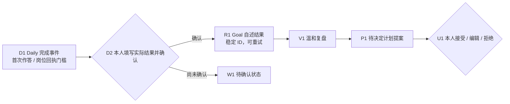

# 每日结果与目标复盘桥（Issue #32 草案）

这层只把**本人确认**的每日任务结果接回目标历史。它读取 `DailyStore` 已提交的任务事件，向 `GoalStore` 追加 `self_report` 结果、复盘和待决定计划提案。活动观察、窗口停留、代码提交、打开岗位页面不会调用这条确认接口，也不能证明练习掌握、考试通过或岗位投递。

## 事实顺序

1. 用户完成每日任务时，`DailyStore.command("complete", ...)` 先按任务种类核验依据。CET6 类练习需材料、**首次作答**、复盘三个引用；`apply_job` 仍需原求职状态机中同岗位、晚于安排时间、带回执的 `submitted` 事件。
2. 客户端展示任务完成记录和本人填写的 `actual_minutes`、可选 `metric`、可选 `evidence_ref`、`note`。本人确认后调用 `GoalResultBridge.record_completed(..., actor="user")`。这四项必须显式传入，即使可选项为 `None` 或空字符串。`actor` 是调用约定，**不是身份认证**；真实 UI 必须在可信的本人操作边界调用，不得把工具事件包装成它。
3. 桥用初次安排事件证明任务来自目标计划；结果版本取**完成时 DailyStore 当前投影的 `plan_version`**，可适应后续安全改期。它再次检查已保存的完成事件及领域依据，然后把 `self_report` 结果写入 GoalStore。分数只是本人记录的练习指标，不推导掌握程度。
4. `status(goal_id)` 将已完成但尚无本人结果的任务列为 `awaiting_user_confirmation`；有结果为 `recorded`，契约错位为 `conflict`。任务完成与目标结果分属两个 SQLite 文件，不能宣称原子提交。若完成写入后结果写入中断，重启后仍显示待确认；用相同输入重试会复用稳定结果与事件 ID。已写入的首次结果不会被覆盖；本人更正使用新的 `correction_id` 追加记录。
5. 未完成、部分完成、受阻由本人显式调用 `record_unfinished`；它不擅自把 DailyStore 任务标为完成或取消。`review_with_proposal` 可对这些自述记录写一条温和复盘，再写一个完整的手动计划**待决定提案**。提案须由调用方提供全部任务和调整理由，不自动生成、更不自动生效；用户随后在 GoalStore 单独接受、编辑或拒绝。



## 本地调用节选

```python
from workbench.goal_result_bridge import GoalResultBridge

bridge = GoalResultBridge(goals, daily)  # 两个 store 使用同一私有 workspace
print(bridge.status("DEMO-CET6"))
result = bridge.record_completed(
    "DEMO-CET6", "DEMO-READ", "DAILY-COMPLETE-EVENT-ID",
    actual_minutes=25,
    metric={"correct": 11, "total": 20, "expected": 14},
    evidence_ref="private/fictional-first-attempt",
    note="本人记录首次成绩；订正后的分数另留记录",
    actor="user",
)
```

`record_completed` 的 `complete_event_id` 必须是相同任务的真实 `complete` 事件 ID；传一个 Codex 观察 ID、`opened_url` 或未提交岗位任务会被拒绝。更正时重传原完成事件 ID 和新的 `correction_id`，首次结果保留。所有例子都是虚构本地数据。

## 限制与后续连接

- 当前没有桌面 UI 身份认证、实际来源文件内容验证、真实 Codex 事件适配器或自动计划建议。仅 `actor="user"` 字符串不构成安全认证；调用方必须把这个方法限于本人确认动作。
- 对 `missed/partial/blocked` 的复盘提案由调用方提供完整 `proposed_items`。这层保留真实结果和用户可决定的建议，不做惩罚、断签或未经确认的跨日改期。低于预期分数本身也不会自动判断考试结果。
- 两库非原子。`status` 能发现 Daily 已完成而 Goal 缺结果，稳定 ID 保证同输入重试；若本人填写的数据在 Goal 写入前随着应用崩溃丢失，需要本人重新确认。复盘和计划提案之间也有一次可恢复的写入边界，重试相同 ID 与内容即可完成。若期间目标/计划版本已被别人改动，桥会报契约冲突，必须重新审阅，不能悄悄改写已生效计划。
- #33 安全改期集成后需在真实 `reschedule` 投影上复测版本归属；本分支的单测对“初始 schedule 为 v1、当前 Daily 投影为 v2”的事实作隔离模拟。
