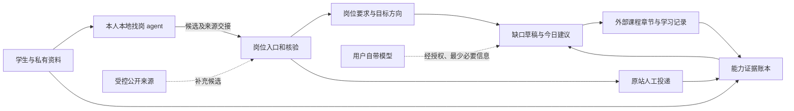

# 架构基线 v0.1（设计，未实现）

本页是供多人协作的**目标架构**，不是当前主线的功能清单。先看[产品边界图](boundary-map-draft.html)和[模块架构图](architecture-map.html)，再按[数据契约](contracts.md)拆任务。主线只有本地求职状态记录；#9 的岗位入口正在独立开发，模型接入、能力地图和练习判题仍待开发。

## 一条产品闭环

学生选择一个或多个目标方向，导入或发现具体岗位，核对原始 JD 和投递入口。工作台把岗位要求与个人证据关联；用户自带模型提出**缺口草稿**，学生纠错后选择合适的外部课程、书籍或题库的具体章节。工作台记录资源选择、学习进度和待验证证据；打开链接或自报学完不代表独立掌握。能力验证是后续独立切片，结果可回流多个方向。适合投的岗位随时可由本人打开原站投递；回执和面试反馈再回流。学习不是投递前置门槛。

箭头表示设计中的数据流，不表示相关功能已经完成。招聘网站、外部学习资源和模型供应商均在工作台信任边界之外。

## 建议的运行形态

Alpha 以**单人、私有工作区的本地网页工作台**作为实现假设：不同人用各自选择的本地 agent 找岗，按同一受控格式交给本地页面；同一套来源适配器可补充候选。各人保存自己的筛选条件、收藏与投递记录；复用现有 Python 标准库领域逻辑和 SQLite 事件记录，新增本地 HTTP/UI 层。模块先做清楚，再决定打包/安装方式。公开演示只能使用虚构资料。

这是架构选择而非“零基础用户已能安装”的事实。Beta 必须让另一名学生在自己的设备上独立启动并完成任务；若启动门槛过高，需要先改交付方式。托管式多人网站是后续独立决策：没有身份认证、租户隔离、密钥管理、删除/导出与运营责任的设计和测试前，不能把本地私有数据直接迁到云端。

## 模块与责任边界

| 模块（拟建） | 输入 → 输出 | 不负责 | 首个关联任务 |
|---|---|---|---|
| `job_sources` | 本地 agent 受控候选导入、用户链接/JD、补充公开职位接口 → 待核验岗位、来源身份、时间和原站链接 | 任意 URL 服务端抓取、采信 agent 的符合/在招结论 | [#9](https://github.com/johnnyzhang-eng/career-workbench/issues/9) |
| `job_review` | 岗位快照 → 学生确认的字段、资格未知项、原站入口 | 从 HTTP 200 推断开放状态 | [#5](https://github.com/johnnyzhang-eng/career-workbench/issues/5) |
| `targets` | 学生约束、已确认岗位 → 一个或多个可修改方向 | 输出录用概率或强制唯一方向 | [#5](https://github.com/johnnyzhang-eng/career-workbench/issues/5) |
| `evidence` | 项目、自述、作答、复测、面试反馈 → 分级证据与事件 | 因简历出现关键词就标掌握 | [#3](https://github.com/johnnyzhang-eng/career-workbench/issues/3) |
| `gap_planner` | 岗位要求、证据、授权的模型响应 → 可追溯缺口草稿与建议 | 把模型草稿当事实或自动改资格 | [#3](https://github.com/johnnyzhang-eng/career-workbench/issues/3) |
| `resources` / `learning` | 已确认技能、资源元数据与前置 → 外部章节推荐、进度和待验证证据 | 自建课程、复制第三方正文、仅凭打卡判掌握 | [#2](https://github.com/johnnyzhang-eng/career-workbench/issues/2) |
| `applications` | 岗位入口、本人确认与真实回执 → 投递事件 | 自动海投、自动联系、代填验证码 | 现有 `career.py` 底座；后续独立 Issue |
| `model_port` | 用户许可、最少必要上下文、模型配置 → 结构化候选建议 | 保存明文密钥、后台收费调用 | [#3](https://github.com/johnnyzhang-eng/career-workbench/issues/3) |

这些是**逻辑边界**，不是必须立刻拆成八个包或服务。Alpha 保持单体，模块通过[版本化契约](contracts.md)交互；避免前端、模型提示词和数据库各自定义一套“已掌握”。现有 CLI 的状态机不因新 UI 被绕过。模块所有者可并行改动不同端口，但契约变更先走评审。

## 模型与 skill 的分工

每人的本地 agent 负责按本人条件寻找并提出岗位候选；其工具和模型由本人选择，输出须带来源、时间、推荐依据及未知项。工作台不自动启动这些 agent。LLM 也可在后续授权路径中提出 JD 要求、经历与能力映射等可反驳草稿。确定性代码负责输入校验、ID、去重、资源筛选、学习进度与能力证据分离、来源与时间、数据保存和权限。首片不实现判题与间隔复测；未来验证端口须单独定义新题、求助与判定规则。学生负责确认岗位、纠正模型、决定投递；能力状态只因有质量的独立证据而更新。

仓库级 [career-gap-coach skill](../../.agents/skills/career-gap-coach/SKILL.md)是供 Codex 协作者和早期人工试验使用的**方法样板**，不等于网站的模型接入，也不是全体用户必须安装 Codex。运行时用 `model_port` + 结构化输出验证实现同一规则；将来可将经过真实任务验收的提示策略迁入产品。SQL、Python、算法等主题先扩展外部资源目录与技能映射；能力验证另行设计，不复制出许多近似 skill。

## 私密数据与外部调用

个人资料、JD 全文副本、作答、回执和模型配置属于学生私有工作区；公开仓库只放虚构测试数据与通用方法。外部职位接口仅供读取公开岗位，不接收简历。模型调用前给出将发送的数据、目标模型和预计费用；默认不发完整简历、录音、联系人或回执。用户拒绝调用或模型不可用时保留“未分析”，不生成伪造的缺口结论。

原始 JD/网页内容和本地 agent 输出都是不可信输入：模型看到的招聘文字不能改变系统规则、读工作区外文件、调用工具或提交申请。即使返回符合结构的 JSON，也要校验字段、来源引用、外链和权限范围；无出处、冲突或打不开的链接标为未知，交人核查。密钥不能进前端公开包、URL、仓库、日志或 CI。具体密钥保存方案随部署形态另行评审。

## 退路和故障语义

| 情况 | 应有行为 |
|---|---|
| 招聘页需登录、动态加载、403 或空白 | 保存来源，允许本人粘贴 JD；不能推断岗位已关闭 |
| 职位接口有记录但原站链接不可投 | 标待核验；本人查看届别、城市、学历、开放状态 |
| 模型未配置、拒绝授权、失败或返回无来源建议 | 保留已有资料，显示“未分析/待确认”，可手工继续 |
| 学生请求提示或使用 AI 答题 | 留下求助标记；本题不计独立通过，安排新题复测 |
| 学习资源链接失效 | 标不可用并重新核验；不把“已推荐”当成可学习 |
| 没有投递回执 | 保持准备/待确认状态，不能标为 submitted |

## 协作与放行

以[完整任务链](delivery.md)和[协作契约](collaboration.md)开发，不按模块数量判断完成。2026-09-19 用户把持续找岗与原站投递入口提为第一条切片 [#9](https://github.com/johnnyzhang-eng/career-workbench/issues/9)：每人的本地 agent 发现候选并按受控契约导入私有工作区；两名虚构用户分别筛选并打开原站详情和投递入口，本人申请后凭真实回执登记。一个明确文档的公开接口可重复刷新，作为补充来源保留最近成功快照。agent 输出与接口返回都不保证职位可投；实际覆盖和候选质量另行核验。下一切片 [#8](https://github.com/johnnyzhang-eng/career-workbench/issues/8) 才走外部课程章节推荐和学习进度；两条路径共享岗位引用，学习不阻断投递。每个 PR 要给出用例、未实现边界、隐私检查和实际运行结果。

## 存储与网页边界（拟建）

学习记录独立于旧 CLI 的投递后复盘任务：LearningActivity 引用资源和技能，LearningEvent 追加进度；能力证据单独保留待验证。旧 practiced 只作自述，不升级为自动判题结果。事件 ID 保证幂等，事件与投影同事务；先用虚构旧库测试兼容。

网页只监听 loopback，写请求须校验 Host/Origin 与有效载荷，静态目录不得暴露 private/；外链只允许 http/https。原站学习账号与记录不自动读取，打开链接只能记 opened。模型密钥与私人资料不进入浏览器静态包。

## 尚未拍板

- 各人本地 agent 如何持续运行、候选质量与重复率，以及公开接口的有效覆盖、许可和维护成本：先做真实任务和小样本核验，不承诺“全网找岗”。
- 本地网页的安装/启动方案、是否需要托管服务及其成本：用零基础用户真实启动任务决定。
- 用户自带模型的首个可运行适配器、密钥保存与费用预估：先实现一个可验收接口，不宣称兼容所有模型。
- 第三方 JD/学习内容的展示范围：逐来源核查条款；默认展示必要摘录与原始链接。

决策改变时在 Issue 中记录候选方案、依据、反证和迁移影响；本页及合同同步更新，避免“文档说 A、代码做 B”。
