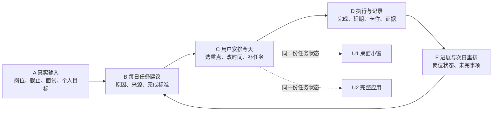
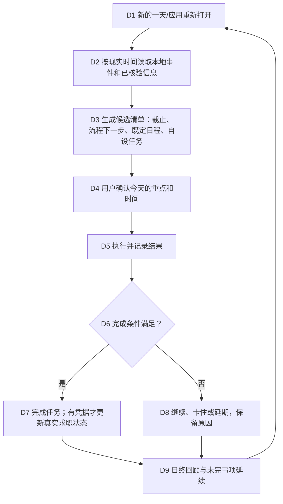

# 秋招每日工作台：产品与开发计划

状态：2026-09-24 提案；[GitHub 产品方向 Issue #12](https://github.com/johnnyzhang-eng/career-workbench/issues/12)。用户已确认目标执行系统的价值优先，并要求能支持秋招以外的目标；见[定位与体验门槛](./product-direction-gate.md)。本计划详述秋招这一首批领域样例，每日 checklist、桌面常驻和 3D 场景仍是待评审的呈现与实现方式。任务逻辑与游戏场景并行使用[首个纵向切片契约](./vertical-slice-contract.md)作探索边界。[参考视频观看记录](./reference-video-analysis.md)用于建模、场景、反馈与试玩迭代。

## 目标与仓库决策

产品的通用目标是帮助用户设置目标、拆成可执行的每日行动、记录实际情况并调整计划。秋招求职与技能学习是首批知识重点；本计划以秋招为第一条详细用例。角色、场景与动效呈现行动和进展，不能替代可解释的计划、结果记录与调整。第二条 CET6 对照用例见[定位门槛](./product-direction-gate.md)，用于检查底座是否真的脱离岗位运行。

**建议继续使用 `johnnyzhang-eng/career-workbench`。**主线已有求职状态机和个人本地工作区；在飞分支另有岗位导入、来源与未知项展示。这些能力正好是每日任务的事实基础。新建仓库会把任务与岗位状态拆成两套。本仓已有产品方向 [Issue #12](https://github.com/johnnyzhang-eng/career-workbench/issues/12)；每日任务内核和桌面界面再按验收边界拆分。未来若桌面客户端有独立发布周期，可先从同仓的独立目录发展，届时再凭实际维护负担决定是否拆仓。

## 总体逻辑

当前 `career.py` 的 `today()` 只给出每个岗位的下一步摘要；开发分支的网页能导入与浏览岗位。B–E 和 U1/U2 的共享每日任务机制尚未实现。

## 两层 UI

**U1 桌面小窗：**默认在右上角，可收起为图标，并能逐级展开。小窗显示现实日期/时间、今日完成数、下一件事、最近一个有来源且已核实的截止、待确认提示。点击任务可开始、完成、延期或标记卡住；复杂处理跳到完整应用。用户控制置顶、开机启动、提醒和隐私遮挡。真正嵌入壁纸或系统原生组件，待桌面原型比较后决定。

**U2 完整应用：**

| 页面 | 主要问题 | 核心动作 |
|---|---|---|
| 今天 | 今天先做什么，为什么？ | 排序、定时、开始、完成、延期、卡住 |
| 任务详情 | 怎么才算做完？ | 看关联岗位/来源/截止/完成条件，打开资料，记结果 |
| 机会 | 哪些岗位值得处理，走到哪一步？ | 导入、核验、准备、原站打开、真实回执 |
| 日历与回顾 | 接下来何时有硬截止？ | 周视图、面试/宣讲、未完延续、历史 |
| 设置 | 怎样陪伴但不打扰？ | 时区、工作日、安静时段、提醒、桌面显示、导出 |

完整应用的首个画面需让用户看清当前目标、今日下一步、依据与完成条件；宿舍/书桌是正在比较的游戏化呈现样机，并非已冻结的首屏或 3D 路线。桌面小窗与完整应用读取同一任务事实，动画由已记录的业务状态驱动。首屏布局与 2D/2.5D、3D 方案由 [#13](https://github.com/johnnyzhang-eng/career-workbench/issues/13) 的逐屏路径和 [#20](https://github.com/johnnyzhang-eng/career-workbench/issues/20) 的运行对照决定。

## 每日流程与任务状态

状态为 `建议 → 已安排 → 进行中 → 完成`；进行中可转 `卡住/延期` 再安排，建议或已安排可 `略过/取消`，历史保留。首版由有来源的规则／模板提出目标计划和今日行动，AI 可提议个性化修改；候选和生效计划分开保存。只有未开始的弹性任务可自动排序或挪动时段，且留记录、可撤销；其他变更经用户确认。系统不能仅凭外部活动自动勾选真实结果，详见[决策台](./decision-register.md)。

每项任务至少有稳定 ID、类型、所属目标/计划版本、可选的关联岗位/事件、来源与建议理由、现实日期/时区、提醒时间/截止、完成条件、状态事件和可选证据。任务类型首批包括：核验资格、准备材料、本人投递、跟进反馈、面试/笔试准备、学习练习、用户自设。任务“已完成”和岗位“已投递/收到回复”分别记录：打开链接只证明打开；本人投递须已有材料确认与真实回执；课程打勾不等于独立掌握。

跨午夜、休眠、重启和跨时区时按真实时钟重算，未完任务带着原日期与原因延续，不自动判失败。真实截止只在来源明确且时区核对后显示倒计时；“招满即止”与未知截止不生成精确数字。外部岗位按来源刷新或人工核验，不宣称掌握所有网站的实时变化；每条显示上次成功同步/核验时间。无回复不自动判拒绝，页面暂时打不开不自动判岗位关闭。

## 实施架构

同一份本地数据驱动两种界面：`现实时间与任务规则 → 任务/岗位事件存储 → 用例接口 → 完整应用与桌面小窗`。旧求职状态机继续控制真实状态；每日任务只提出和跟踪“下一步”，不能绕过确认与证据门槛。浏览器/桌面技术栈在一个最小原型中比较，优先保证本地安装、重启恢复和小窗交互。个人资料保存在私有工作区；锁屏时可隐藏公司和面试信息；公开演示只用虚构数据。

## GitHub 上的开发顺序

| 阶段 | 输入 → 交付物 | 验收 | 责任 |
|---|---|---|---|
| P0 双路径设计 | 秋招与 CET6 的虚构七天、首日逐屏操作 → 今日页/小窗线框；[#13](https://github.com/johnnyzhang-eng/career-workbench/issues/13) | 用户能逐屏指出“看到什么、点什么、记录去哪”；现实/模拟分清 | 产品与用户 |
| P1A 目标与计划契约 | P0 + 现有任务事件 → 通用目标、计划版本、结果与复盘；[#21](https://github.com/johnnyzhang-eng/career-workbench/issues/21) | CET6 无岗位 ID 可运行，微调可撤销，重大变更须确认 | 逻辑对话 |
| P1B 每日任务内核 | P1A + 现有 CLI → 日期化任务、事件、延续与提醒规则；[#15](https://github.com/johnnyzhang-eng/career-workbench/issues/15) | 跨日/休眠/重启无漏项或重复提醒；真实投递门槛保持 | 逻辑对话 |
| P1C 美术与窗口比较 | P0 + 同一虚构快照 → 2D/2.5D 与精修 3D、小窗层级试验；[#20](https://github.com/johnnyzhang-eng/career-workbench/issues/20) | 运行中可读、可操作、许可清楚、资源占用可接受；用户选择呈现路线 | 视觉对话 |
| P2 首日集成与常驻 | P1A–P1C → 同一任务状态驱动场景、右上角小窗和完整工作台；[#17](https://github.com/johnnyzhang-eng/career-workbench/issues/17) | 完成/延期/重排和重启后状态一致，跨应用不挡操作 | 集成与测试 |
| P3 真实试用 | 私人工作区 + 独立学生试用 → 计划、视觉、安装与优先级修正 | 连续一周能安排、完成、追踪；隐私与事实边界通过 | 产品与测试 |

每一阶段在 GitHub 有父 Issue 下的可验收任务卡，分支/PR 关联 Issue，使用虚构数据测试并做隐私预检；个人任务、真实简历和回执不写入公开 Issue/PR。通用目标契约见 [#21](https://github.com/johnnyzhang-eng/career-workbench/issues/21)，每日任务内核见 [#15](https://github.com/johnnyzhang-eng/career-workbench/issues/15)，3D 对照基线见 [#16](https://github.com/johnnyzhang-eng/career-workbench/issues/16)。现有 #9 岗位发现是输入能力，#8 学习资源可成为任务动作；它们不被新 UI 的进度条替代。

**第一批任务卡：**T01–T02 的首轮设计工作由 [Issue #13](https://github.com/johnnyzhang-eng/career-workbench/issues/13) 追踪；后续切片按验收边界建 Issue。

| 卡 | 输入 → 产物 | 验收 | 责任 |
|---|---|---|---|
| T01 虚构一周 | 两岗位、一场宣讲、一次面试 → 七天任务/事件表 | 每项有来源、完成条件、跨日结果 | 产品 |
| T02 双界面线框 | T01 → 今日页、任务详情、小窗草图 | 同一任务两处状态一致，首屏能找到下一件事 | UI |
| T03 任务契约 | T01 + 旧状态机 → 任务/事件模型 | 打勾不能绕过真实投递回执门槛 | 开发 |
| T04 时间测试 | T03 → 跨日、休眠、重启、时区场景 | 无错误倒计时和重复提醒 | 开发/测试 |
| T05 桌面原型 | T02 → 小窗与完整应用最小联动 | 可交互、可恢复，技术路线有试用证据 | 桌面开发 |

用户已选可收起的右上角小窗为默认入口；桌面层和普通窗口用于比较。完整应用与小窗共用任务状态。首次美术范围控制在一间可玩的场景和一个角色，同场景比较 2D/2.5D 与精修 3D，做到角色、动作、UI、任务反馈均可验收后再扩展。
