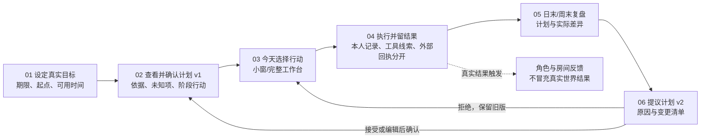

# 实时目标伴随系统：决策台与并行开发地图

状态：2026-09-24 首轮集中产品决策已记录，细节通过样机与试玩继续校正。归属 [#12](https://github.com/johnnyzhang-eng/career-workbench/issues/12)。本页区分用户已确认的边界与团队可自行迭代的实现细节；它是开发路线的共同输入，尚非发布承诺。

## 一句话目标

用户设定一个真实目标，系统给出可解释的阶段计划和今日行动；用户执行后记录结果，系统依据事实提出下一版计划。角色与房间让过程可见、有趣，角落入口让系统能陪伴日常电脑工作。

首批深入支持秋招求职和技能学习；用 CET6 检查通用底座能否脱离岗位记录运行。真实投递、考试成绩和技能掌握必须有独立证据，不能由场景动画或活动记录推断。

## 已确认，不再反复询问

| 编号 | 决定 | 开发含义 |
|---|---|---|
| C01 | 以每天真实使用的目标执行为主，游戏反馈服务这个循环 | 首日必须完成目标→行动→结果→调整，不能只展示房间和任务卡 |
| C02 | 底座通用，秋招与技能学习先做深，CET6 是第二条端到端样例 | 目标与任务不得强制关联岗位 ID；领域证据规则可插拔 |
| C03 | 游戏时间与现实时间同步 | 使用系统时钟和明确时区，休眠、跨日、重启后重算；没有加速日历 |
| C04 | 继续使用 `johnnyzhang-eng/career-workbench`，通过 Issue、分支、PR 开发 | 原有求职事实和状态机继续作为领域模块；草案 PR 可并行但不自动冻结产品定义 |
| C05 | 常驻入口可逐级展开，闲置时低干扰 | 房子图标、小预览、今日面板、完整工作台共用状态；透明度和窗口层级独立验证 |
| C06 | 角色生成可借鉴 Windup 的制作流程，成品风格另找游戏参考 | 不复制 Windup 成品或参考游戏资产；美术以实际小窗和运行画面验收 |

## 六项产品边界与当前决定

这些选项已由用户集中选择。自动调整的“弹性任务”须在任务数据中明确标记，不能由系统临时猜测。

| 编号 | 需要决定 | 用户选择／状态 | 影响与停工点 |
|---|---|---|---|
| D01 | 首版是两条深入路径加任意目标手动任务，还是任意目标都自动规划 | **已定：秋招＋CET6 完整路径，其他目标手动任务** | 先做两条可验收的知识路径；目标内核允许其他目标手动使用 |
| D02 | 新计划与重排是否须用户确认 | **已定：仅未开始的弹性任务可自动排序或挪动时段** | 每次自动调整留原因、前后值和撤销入口；跨日顺延、任务量、阶段计划、目标、硬截止、删除及证据规则仍要提案和确认 |
| D03 | 可读取哪些电脑活动 | **已定：工作台操作＋明确连接的工具事件** | 每个连接可授权/暂停；活动线索不直接证明外部结果，不默认读取屏幕内容 |
| D04 | 本机保存还是首版同步多设备 | **已定：本机优先** | 本地状态持久化与导出优先；多设备同步另行设计 |
| D05 | 默认常驻形态 | **已定：可收起的右上角小窗** | 角落尺寸和遮挡作为首要 QA；桌面背景与普通窗口仍作为比较项 |
| D06 | 2D/2.5D 与 3D 如何定路线 | **已定：同场景实测后由用户选择** | 角色/房间大规模制作和 #17 渲染层集成等待比较结果 |

## 计划生成和反馈口径

| 编号 | 决策 | 用户选择／状态 | 开发含义 |
|---|---|---|---|
| D07 | 首版计划如何生成 | **已定：有来源的规则／模板起步，AI 提议个性化修改** | 每条建议展示依据与未知项；AI 输出是候选，不因生成成功而替换已生效计划；本地演示不用付费 API |
| D08 | 未完成或结果低于预期时的游戏反馈 | **已定：温和反馈并提出调整，不惩罚** | 保留事实与阻碍，角色反馈支持继续行动；不扣分、不以失去连胜制造压力 |

## 由团队处理、必要时带证据回报的细节

以下选择可回滚，团队按体验和测试结果作决定：存储表/文件的内部布局、快照字段增量、任务排序策略、角色动画参数、非关键家具素材、任务卡间距、图标细节和工程工具。若某选择改变个人数据范围、引入按次费用、公开真实资料、承诺外部结果或固定 2D/3D 路线，应升级到上表或对应 Issue，不能在实现中悄悄决定。

## 一个目标从今天走到下一周

小窗、场景和完整工作台是同一个 Goal/Plan/Task/Result 的不同视图。桌面活动只是候选线索，外部申请回执由求职模块校验，练习结果由学习模块解释；游戏层只订阅已记录的状态。

## 并行工作与合流门槛

| 工作线 | 当前承载 | 可继续独立完成 | 合流前必须满足 |
|---|---|---|---|
| 产品与交互 | [#13](https://github.com/johnnyzhang-eng/career-workbench/issues/13)、[PR #14](https://github.com/johnnyzhang-eng/career-workbench/pull/14) | 秋招/CET6 各七天、首日逐屏操作、图与决策表 | 用户能用两个目标走通创建、执行、复盘，校正首屏和结果证据 |
| 通用目标契约 | [#21](https://github.com/johnnyzhang-eng/career-workbench/issues/21) | 目标、计划版本、复盘候选与拒绝/编辑历史；不依赖岗位 ID | 与 #13 两条路径核对，再确定迁移和快照版本 |
| 首版计划模板 | [#27](https://github.com/johnnyzhang-eng/career-workbench/issues/27) | 秋招/CET6 两条有来源、可解释的首版计划提案 | 先生成候选，再由用户决定；未知截止不编造 |
| 每日任务事件 | [#15](https://github.com/johnnyzhang-eng/career-workbench/issues/15)、[PR #18](https://github.com/johnnyzhang-eng/career-workbench/pull/18) | 时间、幂等事件、跨日与真实结果边界 | 接入通用目标，不把工具线索误当完成 |
| 显式活动输入 | [#23](https://github.com/johnnyzhang-eng/career-workbench/issues/23) | 本地、可暂停与删除的工具事件线索收件箱 | 只有明确连接的来源可写入；线索不能自动完成任务 |
| 美术与桌面形态 | [#20](https://github.com/johnnyzhang-eng/career-workbench/issues/20)、[PR #19](https://github.com/johnnyzhang-eng/career-workbench/pull/19) | 同场景 2D/2.5D、精修 3D、角落尺寸与窗口层级比较 | 用户看运行效果后选择路线；角色、UI、许可与资源占用过门槛 |
| 首日集成 | [#17](https://github.com/johnnyzhang-eng/career-workbench/issues/17) | 可先做渲染无关的适配和虚构演示脚本 | 前四线的状态、命令与所选呈现路线稳定后合并一个可玩首日 |

建议的合流顺序是产品路径与通用契约先互相校验；每日事件内核随后适配，活动输入保持为观察事件；美术比较独立推进；最后在 #17 连接一条真实时钟下可重开的完整日循环。各线可以同时开发草案，合流只按上面的证据门槛，不按谁先写完代码。

## 首日验收脚本（虚构资料）

1. 创建一个七天目标，确认计划 v1，今天出现有来源和完成条件的一件事。
2. 在右上角小窗打开任务详情，开始任务；完整工作台立即看到相同状态，角色给出相符动作。
3. 记录实际结果。只打开招聘页面时不能显示已投；有人工确认的回执时才改变投递状态。练习完成也不能显示 CET6 通过。
4. 把另一件事延期到明天；次日能看见原日期、延期原因和当前安排。
5. 复盘生成带理由的计划 v2 建议；用户接受、修改或拒绝后，旧计划与原始结果仍可查。
6. 关闭并重开应用，任务、计划版本和游戏反馈从同一事实源恢复；角落小窗不遮挡实际工作。

此脚本通过代码测试、两种窗口尺寸的实际运行、隐私检查和用户试玩分别验收。代码可运行只证明其中一部分。
