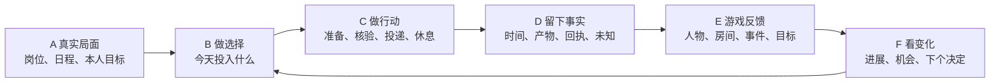

# 秋招实时伴随游戏：定位与体验门槛（待评审）

状态：2026-09-24 产品提案，隶属 [Issue #12](https://github.com/johnnyzhang-eng/career-workbench/issues/12)。本文把用户最近提出的“真实秋招任务 + 实时跟随 + 游戏式生活空间”重新放在产品中心；它不是已接受的规格，也不表示现有样机达到了成品质量。

## 先定产品目的

**定位假设：**帮助参加秋招的大学生在岗位信息、截止、准备、投递、反馈和日常生活之间做出下一步选择，并持续看见自己真实做过的事、尚不确定的事和接下来的机会窗口。游戏世界让时间、行动与后果更易感知，也让长期过程有陪伴感和探索感。桌面小窗只是其中一个入口；完整体验需要可理解的目标、选择、反馈、变化与复盘。

这个循环仍需用户逐项校正。尤其要确定：首版主要解决“分散且难启动的真实求职行动”，还是主要提供“以真实秋招为背景的模拟人生体验”；两者可以结合，但优先级将决定任务深度、剧情和美术投入。不能仅因 checklist 能实现，就把产品定义成清单加角色皮肤。

## 现实与游戏的关系

| 层 | 来源与作用 | 不可跨越的边界 |
|---|---|---|
| 真实机会 | 本人选择的岗位、来源、资格、截止、申请入口 | 未核验仍为未知；不把打开页面记为投递 |
| 真实行动 | 用户确认的任务、工作时段、成果与回执；获授权工具可提供活动线索 | 工具事件只能提示或辅助记录，不能独自证明投递、掌握或雇主结果 |
| 游戏反馈 | 角色动作、房间变化、阶段目标、叙事事件、情绪氛围 | 模拟内容要有可识别的标记，不能冒充真实招聘方反馈 |
| 呈现入口 | 常驻角落、展开面板、完整游戏/工作台 | 三处读写同一任务事实；入口尺寸和置顶设置不改变业务状态 |

## 按沉淀的 GitHub 流程推进

现状核查：本仓已有父提案 #12、按顺序观看的[视频记录](reference-video-analysis.md)、草案 PR #14、每日任务内核 draft PR #18 和 3D 样机 draft PR #19。#13 要求的虚构一周和逐屏线框尚未在这些 PR 中交付或由用户验收；#12 仍为 proposal，PR #14 尚无 review。因而 #18/#19 应作为探索样机和技术证据，不能倒推定位、交互与美术路线已经确定。

| 门槛 | 应有产物 | 通过判据 | 当前状态 |
|---|---|---|---|
| G0 定位 | 目标用户、主要情境、要改善的真实决定、非目标、成功信号 | 用户能用自己的话校正“这个产品为什么值得每天打开” | 待评审 |
| G1 核心体验 | 虚构一周、可玩首日、真实/模拟边界、选择与反馈图、三种界面线框 | 不看开发说明也能说明每天如何开始、做选择、记录结果和继续 | #13 待交付 |
| G2 美术方向 | 视频时间码、可合法引用的游戏参考、角色/房间/UI 风格板；同场景 2D/3D 比较 | 实际角落尺寸与完整场景均可读、统一、有角色身份和世界细节 | #19 是 3D 对照样本，#20 待验证 |
| G3 行为契约 | 任务来源、事件、时间、完成条件、游戏响应与桌面输入范围 | 虚构一周和首日无矛盾；不会把活动线索变成真实结果 | #15/#18 是可修订探索实现 |
| G4 实现与试用 | Issue/负责人/分支/PR、测试、隐私扫描、用户试玩与缺陷回流 | 按本仓 `docs/product/collaboration.md` 的 review 和验收流程进行 | 尚未进入最终验收 |

下一次合并或扩大场景制作前，应先让 G0/G1 可由用户逐屏审阅；并行样机可以继续提供证据，但其 API、画风与首屏布局都不能被视为冻结契约。跨模块改动回到父 Issue 说明，再更新相应文档和任务卡。

## 怎样对齐参考视频的完成度

[观看记录](reference-video-analysis.md)记载了 00:00–21:29 的顺序观看和时间码。它显示视频作者经历了角色锚点与三视图、Blender 网格修整、绑骨与场景、Godot 操作、UI 风格修订、剧情分支抽离和逐项试玩。记录能说明视频展示的过程，不能证明每条玩法分支或当前可玩包都已通过验收。

| 对照维度 | 参考视频展示的制作步骤 | 当前 #19 可运行样机 | 下一道可见验收 |
|---|---|---|---|
| 人物 | 参考锚点、三视图、修网格、绑骨、坐姿与表情 | 基础形体拼成的 Q 版角色；手臂枢轴动作，无骨骼/权重 | 正侧背和小窗轮廓；一套统一造型；工作/休息/完成动作无穿模 |
| 空间 | 有视觉参考约束的房间与家具，反复修灯、杯子、墙面 | 一间稀疏书桌房，材质和灯光仍平 | 能从房间物件读出学生生活和秋招阶段；昼夜材质、光影一致 |
| 界面 | 从角色与场景生成 UI 参考后再试玩和修层级 | 任务面板与房间明显分离；800×600 字小 | 任务信息一眼可见，像世界的一部分；角落与完整界面都过关 |
| 行动反馈 | 工作、休息、谈判、对白和条件事件构成选择与后果 | 固定虚构任务、开始/完成/延期的内存预览 | 一个首日任务有真实行动、可见角色反馈及可解释的下一步 |
| 验收循环 | 资产错误、动画穿模、UI bug 和剧情分支逐次修正 | 已有基本运行与资产 QA，尚无长期任务集成 | 用同一截图/交互脚本反复比较、记录缺陷、复测分支 |

**美术比较方法：**公开文档保留视频时间码和链接，不上传他人的视频帧或游戏资产。内部评审把视频中的关键画面与我们的同用途画面并排看，分别标记构图、轮廓、材质、灯光、动作、UI 融合和互动反馈的差距；先让一个角色、一间房、一个完整日循环过门槛，再扩展地图或素材数量。模型选择和素材来源是实现手段，最终以运行中的画面与试玩体验验收。
