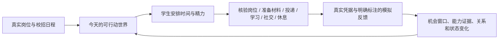

# 参考视频完整观看记录：零基础 GPT6 游戏开发

记录日期：2026-09-24。视频：[Bilibili BV1yHYt6qEQn](https://www.bilibili.com/video/BV1yHYt6qEQn/)，21:29。使用已登录的 Chrome，从 00:00 到 21:29 以 1 倍速顺序观看；以下时间为视频时间。自动字幕有误字，记录以画面和上下文交叉判断，具体快捷键不作为技术教程引用。

## 证据边界

- 视频开头展示的是已经完成的游戏，之后回溯制作过程。开头出现的系统，不代表视频逐项展示了实现代码。
- 作者简介给出的[点击即玩链接](https://www.bilibili.com/toy/liobOE4IfNmrWwQk/index.html)在本次已登录 Chrome 访问时显示“该内容已下架”。因此这份记录能证实视频画面与作者演示，不能独立验收当前可玩版本的全部分支。
- 作者提到的模型、网站、成本、上传限制、测试项数量是其视频中的陈述，不是我们已经复测的事实。视频画面里的开发者回复也不等于功能真实通过测试。
- 视频属于参考，不是我们秋招游戏的需求清单。视觉气质、分支叙事和时间压力可参考，具体题材、数值、规则仍需重新设计。

## 按顺序观看的步骤

| 时间 | 画面与操作 | 对复刻的意义 |
|---|---|---|
| 00:00–01:52 | 先展示成品：Q 版角色在房间和工作桌前行动；日期、时刻、金钱、角色状态、任务、底部时间轴同屏。客户有性格、修改概率、结果质量和回复期限；餐厅谈大单有对话选择，技能不足可外包；还有关系、借钱、房租、刮刮乐与不同结局。 | 核心体验是“空间里的角色 + 连续时间 + 有后果的选择 + 日常压力”，不是一页岗位看板。片段只演示了部分路径。 |
| 01:52–03:43 | 介绍 Blender 建模、Godot 游戏引擎、Kimi 剧本辅助、游戏 UI 资产生成、商用字体来源和 Bilibili Toy 的轻量发布方式。 | 这是资产、引擎、剧本、UI、发布的完整工具链。作者声称 Toy 有包体限制，未在本次独立核验。 |
| 03:44–06:31 | 演示帐号、额度、模型与操作权限等开发准备。 | 属于作者个人的开发环境与费用经验，不能直接当作我们必须购买的前置条件。 |
| 06:31–07:23 | 先定一个能在游戏页按键响应的小人；上传本人照片、已有 2D 形象和桌面等参考，要求找角色锚点、确定风格、生成三视图；确认后再生成 Blender 模型。 | 先锁视觉锚点和最小可动对象，再进入复杂场景。三视图是中间验收物。 |
| 07:23–10:17 | 在 Blender 打开模型逐处检查。删除不自然的手与多余球体，重建、镜像、设置材质、合并；检查面朝向，修复嘴和衣服等反向法线。 | AI 生成资产要检查网格、材质、法线和不同视角，不能仅凭渲染图判断可用。 |
| 10:17–11:28 | 保存修订模型，再要求绑骨、刷权重、制作坐姿与桌面房间；用卡通房屋截图约束家具风格。输出仍有台灯放置错误与衣服拉伸到地面的动画问题。 | 角色、动作和场景需要联合验收；参考图可约束风格，但仍需人工检查穿模和物体位置。 |
| 11:28–13:44 | 回 Blender 调桌灯与衣服。发现灯杆等对象是曲线而非网格，需转成网格才能可靠导入；修整杯子等物件的原点；对穿模截图反馈再生成，并复查装饰物面朝向。 | 导入游戏前需要统一的资产检查表：网格类型、原点、法线、骨骼权重、动画、场景连接。 |
| 13:44–14:42 | 创建 Godot 项目、放入资产、运行第一版。最早的循环是点击角色工作挣钱，不操作时摸鱼；连续点击可使角色过劳。 | 先做一个可玩动作及其反馈，再加完整系统。第一版还有死亡表现和工资显示等 bug。 |
| 14:42–15:26 | 发现死亡后下沉、缺音效、工资输入与实发显示不一致等问题，逐项反馈修正；开始批评默认 UI 太像商务界面。 | 金钱和状态必须以同一事实源驱动；视觉风格需尽早和题材匹配。 |
| 15:26–16:10 | 使用角色与场景图生成模拟经营 UI 参考，再让开发模型为第一关绘制和接入。为减少每次启动引擎的测试成本，转为轻量网页试玩包。 | UI 参考图只是方向，仍要验证各组件能否实际交互。浏览器预览缩短迭代周期。 |
| 16:10–16:48 | 网页中试玩，加入可旋转视角；处理两面墙交接处的缝隙和闪烁，以立柱遮挡。 | 关注运行中的 3D 画面问题，而非只看静态截图。 |
| 16:48–17:39 | 开始剧情系统。以真人照片和画风参考做透明 PNG 角色立绘，准备不同表情，把立绘、场景、原基调和玩法策划交给开发模型，生成第一天的对话试玩。 | 场景里的角色动作与对话立绘共同构成叙事；表情需与对白状态对应。 |
| 17:39–19:10 | 试玩中发现对白小改动仍要回代码找。于是把对白、触发位置、选项与表情抽成 UTF-8 文本文件；空段不弹对话，修改文件并刷新即可生效。 | 剧情内容应与程序分离，方便编辑、审校、增删与反复测试。 |
| 19:10–20:24 | 对话含分支、嵌套和隐藏条件。作者在设置中加入开发者事件测试入口，直接跳到指定事件、指定结局或反馈分支逐项检查。 | 必须能复现复杂分支，不应靠从头随机玩到目标事件。 |
| 20:24–21:29 | 总结后续是继续写剧本、加功能、找 bug、复测。作者展示延期成功后弹窗不能关闭、状态栏重叠等问题，建议积攒若干问题后一次提交修复，并提供包体供别人研究。 | 一个 0→1 样机不等于经过完整质量验收；剧情逻辑、状态机、视觉层级都需要持续修整。 |

## 片中真正呈现的玩家循环

1. **看局面**：日期和时间、钱、体力/状态、当前目标、待办与人物关系在同一游戏空间里可见。
2. **做行动**：操作角色工作、学习、谈项目、选择对白、外包、休息、求助或冒险。
3. **付代价**：时间、体力、现金与机会窗口变化；选错对白可能丢订单，赶不上期限可能失去客户。
4. **收到反馈**：人物回应、收益、评价、技能、关系和后续事件改变。
5. **进入下一天/结局**：阶段目标、生活开支和剧情分支让前面的决定累积成不同局面。

注意：视频把“概率”“可延期”“隐藏条件”等都说到了，但未公开足够代码或试玩路径，无法还原准确公式及每条支线。不要把它们编造成已知规则。

## 对“真实秋招大学生求职模拟人生”的转译草案

这是待用户校正的产品推演，不是视频事实，也不是已实现功能。

| 视频机制 | 可考虑的秋招对应物 | 必须守住的事实边界 |
|---|---|---|
| 客户委托和回复期限 | 企业网申、内推、笔试、面试、补材料等截止时间 | 截止时间须来自可核查来源；未知就显示未知，不凭概率生成。 |
| 技能与外包 | 岗位要求、学习、练习、请人反馈简历或模拟面试 | AI 辅助或他人代做不能记为本人独立掌握。 |
| 项目谈判和分支对白 | HR 沟通、宣讲会、面试回答与情境选择 | 游戏模拟对话明确标记为练习；不能当作真实招聘方表态。 |
| 金钱、体力和租金 | 求职预算、时间、压力、课程及出行成本、休息 | 敏感数值由玩家选择是否填写；不能把真实生活困境做成惩罚性随机游戏。 |
| 联系人和关系 | 校友、同学、导师、招聘方接触与跟进 | 关系变化须区分练习剧情与真实沟通记录。 |
| 随机事件和多结局 | 市场波动、临时笔试、岗位变化、不同求职路径 | 真实岗位变化只按来源更新；模拟事件要显式标注。不能承诺录用结果。 |

“实时”尚待定义：它可能指游戏时钟持续推进，也可能指真实校招信息持续更新并与玩家日程同步。两者的技术和体验含义不同，不能悄悄替用户选定。

## 当前设计修正

现有 [game-workbench-concept.html](./game-workbench-concept.html) 是此前的任务工作台概念页，能够表达真实岗位与回执边界，但视觉和互动仍偏仪表盘。看完视频后，不应把这页当作最终游戏形式。下一轮设计应先画“空间、人物、时间、行动、反馈”的可玩首日流程，再讨论引擎、资产和现有工作台如何接入。

## 下一步需要逐一验证

1. 明确“实时”的含义与玩家是否必须每天上线，避免时间压力设计伤害真实求职节奏。
2. 选一个可完成的首日情境，画场景和分支图；所有虚构剧情、真实岗位、玩家填写的事实分层显示。
3. 用真实岗位来源核对截止日期、届别与申请入口；仅本人在原站提交并保存回执后，状态才能变“已投递”。
4. 做可重复试玩的最小循环和开发者事件跳转，验证每个选项对状态的影响。
5. 再比较 2D/2.5D/3D 的可玩样机成本与表现，决定是否复用视频中的 Blender + Godot 路线。
