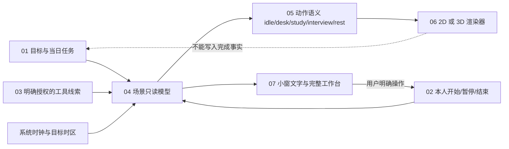

# 房间呈现与真实任务状态：集成草案

状态：2026-09-25，供 #20 美术实验、#34 界面样机及 #17 纵向集成对照；**画风、镜头与窗口尺寸尚未定稿**。这里规定游戏画面如何读取真实任务状态，不让场景动画反向成为求职、考试或能力证据。现有两套样机尚未合流。

## 单向数据流

编号是集成顺序，并非已全部实现。`scene_state` 现有只读模型位于 [PR #38](https://github.com/johnnyzhang-eng/career-workbench/pull/38)；Godot A 原版与受控 3D 实验位于 [PR #35](https://github.com/johnnyzhang-eng/career-workbench/pull/35)。二者目前不能直接互换，需要在同一个本机窗口里实际接线、试玩和测资源。

## 动作和证据的边界

| 输入事实 | 房间可表达 | 房间与任务系统不可据此推断 |
| --- | --- | --- |
| 今天有计划，但尚未开始 | 待机；可提示下一项，人物不自动伏案 | 今天已投入、已完成 |
| 本人明确开始电脑任务 | 坐到电脑前；进入可循环的键盘/鼠标动作 | 已提交申请、写好材料、产出达标 |
| 本人明确开始阅读/练习 | 拿书或看资料；姿势和电脑任务可区分 | 已掌握知识、CET6 已通过 |
| 明确连接的工具发来任务关联线索 | 只标“检测到活动线索”，可提示继续或核对 | 自动确认已做、自动记录外部结果 |
| 本人暂停、结束或跨日后会话过期 | 停止投入动作，回待机或轻微休息；显示任务原状态 | 把中断当失败或抹去昨日结果 |
| 本人记录结果与证据 | 一次短暂、温和的确认反馈，随后回到静止 | 以动画代替结果记录或原站回执 |

同一 `mode` 需要有 `activity_state` 与 `source` 文案：`planned`、`declared_active`、`observed`、`self_selected`、`unknown` 等不能只靠角色姿势区分。渲染器拿到语义状态后只能播放动画；开始、完成、延期和计划改动仍走领域命令。未知状态使用待机，不为了画面热闹猜用户正在做什么。夜晚光照取目标时区的真实时钟；游戏时钟不能加速。

## 3D 质量升级的先后与可比较样本

1. **原 A 留作不可覆写基线。** 用户目前更认可它的定向光与投影。环境光、主光角度、镜头、单件桌面、静态角色、SSAO、紧凑构图均已有独立草案；各实验不叠加作为“新版 A”。每次保留同任务、尺寸、昼夜、动画相位与参数。
2. **先验动作与接触。** 一位原创学生角色先做可编辑的坐姿、双手触键、停顿与起身。小窗原大能认出动作，全窗逐帧检查肩肘、手掌键盘、臀部椅面、双脚地面与衣服；站坐切换不能瞬移、穿模。阅读与休息是下一组独立姿态。
3. **再调整小窗构图。** 原比较器的 360×320 窗口给房间纹理约 344×141 逻辑像素，人物在当前小窗截图里只占几十像素；模型细节会丢失。要用同一角色资产分别试“完整房间”和“聚焦桌前的人物”构图，并记录家具/房间语义是否仍在画面中。放大镜头必须同时检查地板前缘、热点和画面裁切；[PR #42](https://github.com/johnnyzhang-eng/career-workbench/pull/42) 的 93% 距离样本只提供微调证据。
4. **物件与材质按可见收益扩展。** 桌面倒角在全窗可见、小窗变化很小；下一件优先做与动作直接接触的椅子、键盘和可拿起的书。光照、材质粗糙度、几何不可一轮全改后归因。第三方素材要逐文件核许可，并让人物与房间风格统一。
5. **最后评估渲染后期和常驻成本。** Godot 4.7 Compatibility 的默认 SSAO 切换 [PR #41](https://github.com/johnnyzhang-eng/career-workbench/pull/41) 在小窗改动轻微，暂不能证明值得常开。待可辨动作和构图具备后，同机测空闲/动作 CPU、RSS、帧时间和长时运行；收起时应降帧或停渲染。

以上为实验顺序，不是宣布 3D 或像素路线胜出；最终应在**同一事实源、同一个原生小窗、同一任务**里比较。增加模型参数、下载高精资产或生成更大的贴图不自动提升原尺寸可辨性。

## 接线验收

场景渲染器的输入只包含 `mode`、`activity_state`、`source`、`phase`、任务标识和可选短反馈，不读取照片原件、简历或外部网页正文。照片生成角色若启用，原照和生成过程先留本机私有工作区、提供预览与删除；公开仓只放自制虚构样本。渲染器加载失败时任务列表和结果入口仍能使用，房间显示清楚的“画面暂不可用”。

在 360×320 或最终原生小窗、完整工作台两种尺寸，用秋招、CET6 各一个真实时钟驱动的虚构任务走 `计划 → 开始 → 暂停 → 恢复 → 记录结果 → 重启`。逐步保存截图与短录屏，确认：动作和文字状态一致；任务只被本人操作或有依据的领域事件改变；休眠/跨日后动作不假装继续；渲染故障不丢任务数据。桌面小窗与 Godot 网页/原生嵌入能否共存、首次点击、全屏层级和空闲资源都需要实机证据，单独打开 Godot 样机不能代替集成通过。
