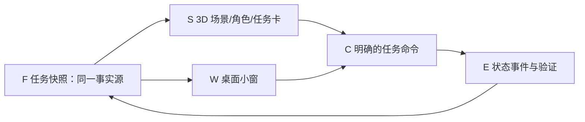

# 首个可玩切片：任务逻辑与 3D 场景的共享契约

状态：2026-09-24 并行开发基线，隶属 [Issue #12](https://github.com/johnnyzhang-eng/career-workbench/issues/12)。这是两个开发对话的对接面；产品行为由用户试玩和后续 PR 校正。所有示例都用虚构学生和虚构岗位。

## 一条端到端路径

玩家打开应用，看到一间宿舍/书桌、Q 版学生、现实日期与今日任务。点击电脑或任务卡，看到“核验一个岗位”的详情、来源和完成条件。玩家选择开始，场景里的角色做相应动作；在详情里留下核验结果后，任务状态更新，场景与小窗都显示新状态。关闭重开后状态仍在。点击“原站申请”只负责导航；没有实际回执不得显示“已投递”。



## 任务快照 v0（先用 fixture，后接本地服务）

两条开发线使用同一份虚构 JSON fixture；字段名称在首个集成 PR 前冻结。视觉线可以用固定快照驱动画面，不能维护第二份任务规则。逻辑线负责生成快照和校验命令。

```json
{
  "schema_version": 0,
  "as_of": "2026-09-24T09:00:00+08:00",
  "timezone": "Asia/Shanghai",
  "today": "2026-09-24",
  "tasks": [
    {
      "id": "DEMO-TASK-001",
      "title": "核验虚构岗位的届别要求",
      "kind": "verify_job",
      "state": "scheduled",
      "source_kind": "job",
      "source_id": "DEMO-JOB-001",
      "reason": "资格仍未知，准备材料前需要核对原岗位页",
      "scheduled_at": "2026-09-24T14:00:00+08:00",
      "due_at": null,
      "due_verified": false,
      "completion_rule": "记录核验结论、原岗位链接和核验时间",
      "evidence_state": "missing"
    }
  ]
}
```

状态命令：`schedule`、`start`、`complete`、`defer`、`block`、`cancel`。每条命令带稳定事件 ID 和发生时间；重复提交幂等。`complete` 先检查任务类型的完成条件，再写事件。任务完成不直接改岗位状态；需要实际提交与回执的岗位转换仍走现有状态机。快照由本地存储重建，UI 不猜测或自行写入“已投递”。

## 现实时间

界面时钟读取系统当前时间。应用从休眠、跨午夜、切换时区或重启恢复时重新计算“今天”和提醒；测试使用注入时钟，无需真实等待一天。来源未核实的岗位截止不显示精确倒计时。角色可以有动作时长，但任务日期与截止不随动画加速。

## 3D 场景和 UI 的最小范围

- **一间场景：**宿舍或书桌，能看见电脑、日历和角色；相机视角能清晰看到任务卡。
- **一个角色：**站/坐/查看电脑或任务/完成反馈等必要动作；动作由任务状态触发，不表达真实企业结果。
- **可操作界面：**今日任务、任务详情、来源/未知标记、开始/完成/延期；键盘和鼠标可用。
- **资产验收：**建模参考、三视图或正侧背检查；Blender 网格/法线/材质/骨骼与权重检查；Godot 导入、碰撞、动画和不同窗口尺寸运行检查。产物保留可编辑源文件或生成脚本。
- **桌面小窗：**本切片先定义相同任务快照下的信息层级；真正打包与常驻在后续 P3。

## 并行归属与集成门槛

[逻辑 Issue #15](https://github.com/johnnyzhang-eng/career-workbench/issues/15) 负责任务模型、事件、时间规则、快照与命令接口、虚构一周用例及测试，不改 3D 场景和美术文件。[视觉 Issue #16](https://github.com/johnnyzhang-eng/career-workbench/issues/16) 负责 Blender/Godot 场景、角色、任务卡和固定快照适配，不改求职状态机。两条线各自以 Issue、分支和 PR 交付；集成工作在双方快照字段和命令语义稳定后连接，验收上述一条端到端路径。

任何需要改共享契约的发现，先回到本文件和父 Issue 讨论，再同步两条线；不得在各自分支悄悄定义不兼容字段。
